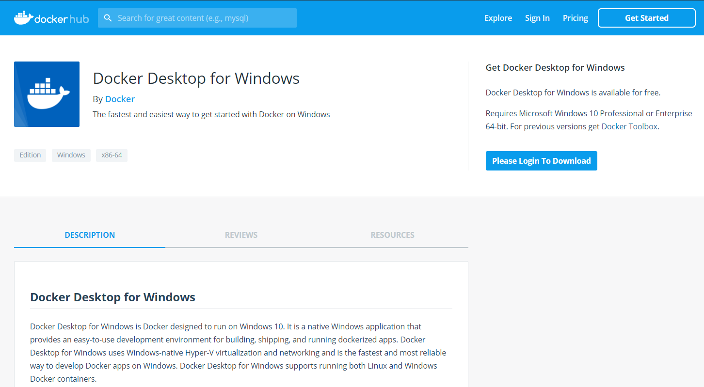

# BTCU_Fabric

## Constents
- [BTCU_Fabric](#btcufabric)
  - [Constents](#constents)
  - [0. Fabric 简介](#0-fabric-%e7%ae%80%e4%bb%8b)
    - [超级账本背景](#%e8%b6%85%e7%ba%a7%e8%b4%a6%e6%9c%ac%e8%83%8c%e6%99%af)
    - [Fabric 背景](#fabric-%e8%83%8c%e6%99%af)
    - [Fabric 架构简介](#fabric-%e6%9e%b6%e6%9e%84%e7%ae%80%e4%bb%8b)
  - [1. 开发环境搭建（Docker、Mac、Windows、Linux）](#1-%e5%bc%80%e5%8f%91%e7%8e%af%e5%a2%83%e6%90%ad%e5%bb%badockermacwindowslinux)
    - [Docker 简介](#docker-%e7%ae%80%e4%bb%8b)
    - [基于 Windows 下的 Docker 安装 Fabric 环境](#%e5%9f%ba%e4%ba%8e-windows-%e4%b8%8b%e7%9a%84-docker-%e5%ae%89%e8%a3%85-fabric-%e7%8e%af%e5%a2%83)
      - [下载 Docker CE for Windows](#%e4%b8%8b%e8%bd%bd-docker-ce-for-windows)

## 0. Fabric 简介

### 超级账本背景

超级账本(Hyperledger)项目是首个面向企业应用场景的开源分布式账本平台。

2015 年 12 月，由开源世界的旗舰组织 Linux 基金会牵头，30 家初始企业成员（包括 IBM、Intel、摩根大通、思科、R3 等），共同宣布了 Hyperledger 联合项目成立。超级账本项目为透明、公开、去中心化的企业级分布式账本技术提供开源参考实现，并推动区块链和分布式账本相关协议、规范和标准的发展。

作为一个联合项目（collaborative project），超级账本由面向不同目的和场景的子项目构成。目前包括 Fabric、Sawtooth、Iroha、Blockchain Explorer、Cello、Indy、Composer、Burrow 等 8 大顶级项目。

这次课程将专注于 Fabric。

### Fabric 背景

Fabric 是最早加入到超级账本项目中的顶级项目，Fabric 由 IBM、DAH 等企业于 2015 年底提交到社区。该项目的定位是面向企业的分布式账本平台，创新地引入了权限管理支持，设计上支持可插拔、可扩展，是首个面向联盟链场景的开源项目。
Fabric 基于 Go 语言实现，目前已经发布了 1.4 版本，同时包括 Fabric CA、Fabric SDK 等多个子项目。

GitHub 地址: https://github.com/hyperledger/fabric/

### Fabric 架构简介

4 种不同种类的服务节点：
* 背书节点（Endorser）：负责对交易的提案（proposal）进行检查和背书，计算交易执行结果；
* 确认节点（Committer）：负责在接受交易结果前再次检查合法性，接受合法交易对账本的修改，并写入区块链结构；
* 排序节点（Order）：对所有发往网络中的交易进行排序，将排序后的交易按照配置中的约定整理为区块，之后提交给确认节点进行处理；
* 证书节点（CA）：负责对网络中所有的证书进行管理，提供标准的 PKI 服务。

一笔交易的典型流程图：

2 种通道：
* 系统通道（system channel）唯一，独立。负责管理网络中的各种配置信息，并完成对其他应用通道（application channel）的创建。
* 应用通道（application channel）可以有多个。供用户发送交易使用。

启动一个 Fabric 网络的主要步骤：
1. 预备网络内各项配置，包括网络中成员的组织结构和对应的身份证书（使用 cryptogen 工具完成）；生成系统通道的初始配置区块文件，新建应用通道的配置更新交易文件以及可能需要的锚节点配置更新交易文件（使用 configtxgen 工具完成）。
2. 使用系统通道的初始配置区块文件启动排序节点，排序节点启动后自动按照指定配置创建系统通道。
3. 不同的组织按照预置角色分别启动 Peer 节点。这个时候网络不存在应用通道，Peer 节点也并没有加入网络中。
4. 使用新建应用通道的配置更新交易文件，向系统通道发送交易，创建新的应用通道。
5. 让对应的 Peer 节点加入所创建的应用通道中，此时 Peer 节点加入网络，可以转变接受交易了。
6. 用户通过客户端向网络中安装注册链码（chaincode），链码容器启动成功后用户即可对链码进行调用，将交易发送到网络中去。

## 1. 开发环境搭建（Docker、Mac、Windows、Linux）

### Docker 简介

[Docker](https://www.docker.com/) 是一类虚拟化技术，类似虚拟机，安装好 Docker 这个软件后，可以在 Docker 里面运行一些定制好了的镜像，比如今天我们用到的就是在 Linux 操作系统里安装了 Fabric 环境的镜像，这样就省去了直接安装 Fabric 的麻烦。更多的镜像可以参考 [Docker Hub](https://hub.docker.com/)。然后本身 Docker 这个软件支持 Mac、Windows 和 Linux，因此也是一个很好的跨平台工具。

### 基于 Windows 下的 Docker 安装 Fabric 环境

参考：https://docs.docker.com/docker-for-windows/install/ 
（参考表示下面的具体安装文档是参考这个链接 + 实际情况得到的，因此一般来讲可以直接根据下面的步骤操作即可，下同）

#### 下载 Docker CE for Windows

从官网这个[链接](https://hub.docker.com/search?q=&type=edition&offering=community)进去，然后下拉，找到 Docker Desktop for Windows，点击下载。

这里显示需要先登录：

如果之前有账户的直接登录，没有的就点击 Sign Up：

登录之后就可以直接下载了：

