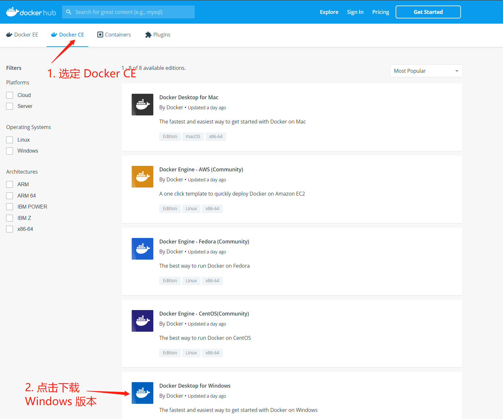
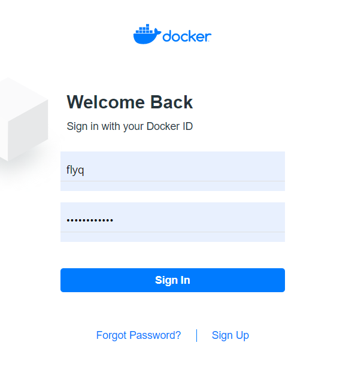
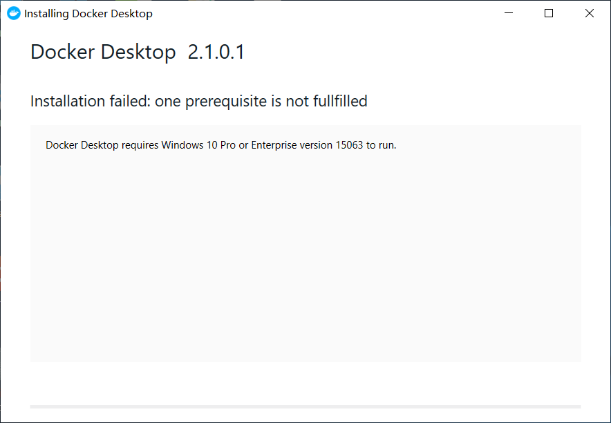
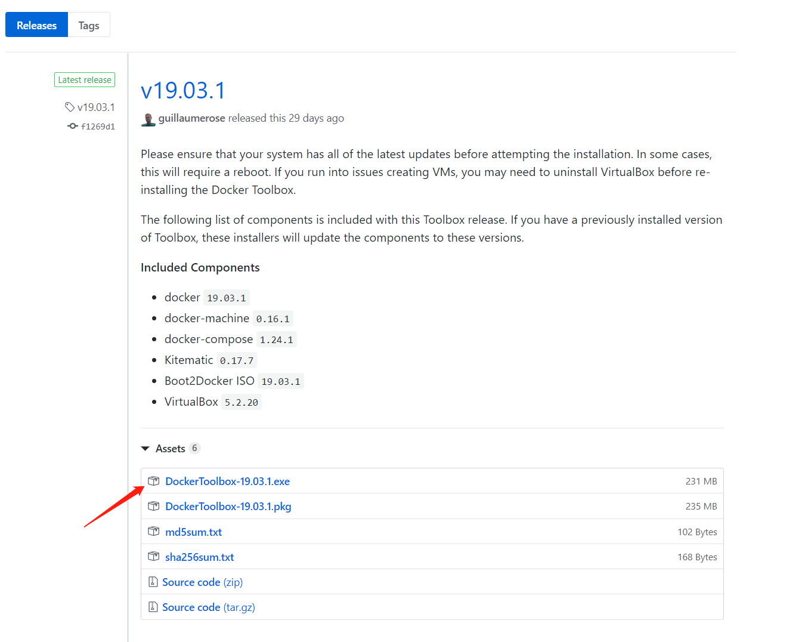
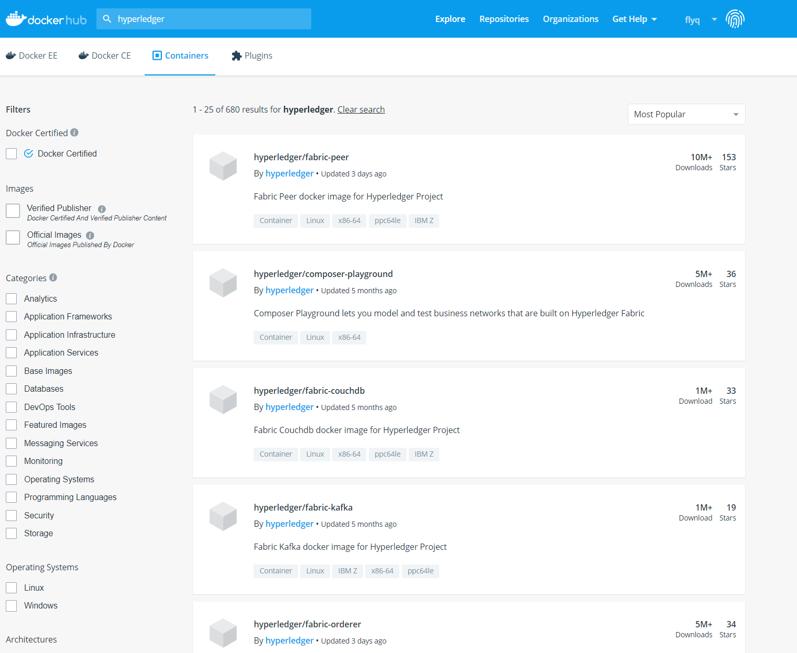
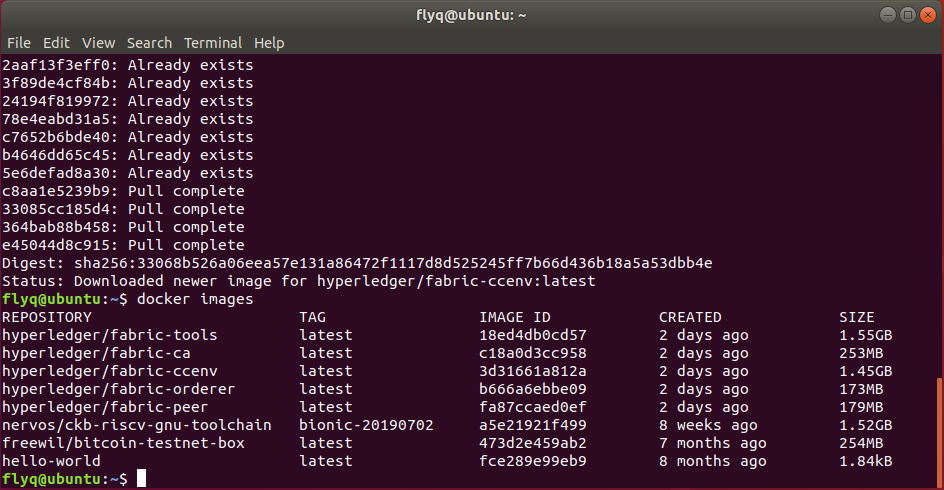

# BTCU_Fabric

## Constents
- [BTCU_Fabric](#btcufabric)
  - [Constents](#constents)
  - [0. Fabric 简介](#0-fabric-%e7%ae%80%e4%bb%8b)
    - [超级账本背景](#%e8%b6%85%e7%ba%a7%e8%b4%a6%e6%9c%ac%e8%83%8c%e6%99%af)
    - [Fabric 背景](#fabric-%e8%83%8c%e6%99%af)
    - [Fabric 架构简介](#fabric-%e6%9e%b6%e6%9e%84%e7%ae%80%e4%bb%8b)
  - [1. 开发环境搭建（Docker、Windows、Linux）](#1-%e5%bc%80%e5%8f%91%e7%8e%af%e5%a2%83%e6%90%ad%e5%bb%badockerwindowslinux)
    - [Docker 简介](#docker-%e7%ae%80%e4%bb%8b)
    - [通过 Windows 下载 Docker 镜像来得到 Fabric 环境](#%e9%80%9a%e8%bf%87-windows-%e4%b8%8b%e8%bd%bd-docker-%e9%95%9c%e5%83%8f%e6%9d%a5%e5%be%97%e5%88%b0-fabric-%e7%8e%af%e5%a2%83)
      - [安装 Docker 环境](#%e5%ae%89%e8%a3%85-docker-%e7%8e%af%e5%a2%83)
      - [在 Docker 里下载定制好了的 Fabric 镜像：](#%e5%9c%a8-docker-%e9%87%8c%e4%b8%8b%e8%bd%bd%e5%ae%9a%e5%88%b6%e5%a5%bd%e4%ba%86%e7%9a%84-fabric-%e9%95%9c%e5%83%8f)
    - [Linux 环境下直接安装](#linux-%e7%8e%af%e5%a2%83%e4%b8%8b%e7%9b%b4%e6%8e%a5%e5%ae%89%e8%a3%85)
      - [安装其他环境：](#%e5%ae%89%e8%a3%85%e5%85%b6%e4%bb%96%e7%8e%af%e5%a2%83)
      - [安装 Golang](#%e5%ae%89%e8%a3%85-golang)
      - [安装 gopm](#%e5%ae%89%e8%a3%85-gopm)
      - [拉取 Fabric 源码](#%e6%8b%89%e5%8f%96-fabric-%e6%ba%90%e7%a0%81)
      - [编译安装 `peer` 组件：](#%e7%bc%96%e8%af%91%e5%ae%89%e8%a3%85-peer-%e7%bb%84%e4%bb%b6)
      - [编译安装 `fabric-order` 组件：](#%e7%bc%96%e8%af%91%e5%ae%89%e8%a3%85-fabric-order-%e7%bb%84%e4%bb%b6)
      - [编译安装 `fabric-ca` 组件](#%e7%bc%96%e8%af%91%e5%ae%89%e8%a3%85-fabric-ca-%e7%bb%84%e4%bb%b6)
      - [编译其他辅助工具：](#%e7%bc%96%e8%af%91%e5%85%b6%e4%bb%96%e8%be%85%e5%8a%a9%e5%b7%a5%e5%85%b7)
    - [`Linux` 下通过 `Docker` 安装：](#linux-%e4%b8%8b%e9%80%9a%e8%bf%87-docker-%e5%ae%89%e8%a3%85)
      - [通过脚本安装（推荐，因为下载的镜像更多，并且还会生成一个 `fabric-samples/` 文件夹，有一个示例）：](#%e9%80%9a%e8%bf%87%e8%84%9a%e6%9c%ac%e5%ae%89%e8%a3%85%e6%8e%a8%e8%8d%90%e5%9b%a0%e4%b8%ba%e4%b8%8b%e8%bd%bd%e7%9a%84%e9%95%9c%e5%83%8f%e6%9b%b4%e5%a4%9a%e5%b9%b6%e4%b8%94%e8%bf%98%e4%bc%9a%e7%94%9f%e6%88%90%e4%b8%80%e4%b8%aa-fabric-samples-%e6%96%87%e4%bb%b6%e5%a4%b9%e6%9c%89%e4%b8%80%e4%b8%aa%e7%a4%ba%e4%be%8b)
      - [安装 Docker](#%e5%ae%89%e8%a3%85-docker)
      - [下载 `Docker` 镜像](#%e4%b8%8b%e8%bd%bd-docker-%e9%95%9c%e5%83%8f)
  - [2、案例运行与使用模拟](#2%e6%a1%88%e4%be%8b%e8%bf%90%e8%a1%8c%e4%b8%8e%e4%bd%bf%e7%94%a8%e6%a8%a1%e6%8b%9f)
    - [](#)

## 0. Fabric 简介

### 超级账本背景

超级账本(Hyperledger)项目是首个面向企业应用场景的开源分布式账本平台。

2015 年 12 月，由开源世界的旗舰组织 Linux 基金会牵头，30 家初始企业成员（包括 IBM、Intel、摩根大通、思科、R3 等），共同宣布了 Hyperledger 联合项目成立。超级账本项目为透明、公开、去中心化的企业级分布式账本技术提供开源参考实现，并推动区块链和分布式账本相关协议、规范和标准的发展。

作为一个联合项目（collaborative project），超级账本由面向不同目的和场景的子项目构成。目前包括 Fabric、Sawtooth、Iroha、Blockchain Explorer、Cello、Indy、Composer、Burrow 等 8 大顶级项目。

这次课程将专注于 Fabric。

### Fabric 背景

Fabric 是最早加入到超级账本项目中的顶级项目，Fabric 由 IBM、DAH 等企业于 2015 年底提交到社区。该项目的定位是面向企业的分布式账本平台，创新地引入了权限管理支持，设计上支持可插拔、可扩展，是首个面向联盟链场景的开源项目。
Fabric 基于 Go 语言实现，目前已经发布了 1.4 版本，同时包括 Fabric CA、Fabric SDK 等多个子项目。

GitHub 地址: https://github.com/hyperledger/fabric/

### Fabric 架构简介

4 种不同种类的服务节点：
* 背书节点（Endorser）：负责对交易的提案（proposal）进行检查和背书，计算交易执行结果；
* 确认节点（Committer）：负责在接受交易结果前再次检查合法性，接受合法交易对账本的修改，并写入区块链结构；
* 排序节点（Order）：对所有发往网络中的交易进行排序，将排序后的交易按照配置中的约定整理为区块，之后提交给确认节点进行处理；
* 证书节点（CA）：负责对网络中所有的证书进行管理，提供标准的 PKI 服务。

一笔交易的典型流程图：


2 种通道：
* 系统通道（system channel）唯一，独立。负责管理网络中的各种配置信息，并完成对其他应用通道（application channel）的创建。
* 应用通道（application channel）可以有多个。供用户发送交易使用。

启动一个 Fabric 网络的主要步骤：
1. 预备网络内各项配置，包括网络中成员的组织结构和对应的身份证书（使用 cryptogen 工具完成）；生成系统通道的初始配置区块文件，新建应用通道的配置更新交易文件以及可能需要的锚节点配置更新交易文件（使用 configtxgen 工具完成）。
2. 使用系统通道的初始配置区块文件启动排序节点，排序节点启动后自动按照指定配置创建系统通道。
3. 不同的组织按照预置角色分别启动 Peer 节点。这个时候网络不存在应用通道，Peer 节点也并没有加入网络中。
4. 使用新建应用通道的配置更新交易文件，向系统通道发送交易，创建新的应用通道。
5. 让对应的 Peer 节点加入所创建的应用通道中，此时 Peer 节点加入网络，可以转变接受交易了。
6. 用户通过客户端向网络中安装注册链码（chaincode），链码容器启动成功后用户即可对链码进行调用，将交易发送到网络中去。

## 1. 开发环境搭建（Docker、Windows、Linux）

### Docker 简介

[Docker](https://www.docker.com/) 是一类虚拟化技术，类似虚拟机，安装好 Docker 这个软件后，可以在 Docker 里面运行一些定制好了的镜像，比如今天我们用到的就是在 Linux 操作系统里安装了 Fabric 环境的镜像，这样就省去了直接安装 Fabric 的麻烦。更多的镜像可以参考 [Docker Hub](https://hub.docker.com/)。然后本身 Docker 这个软件支持 Mac、Windows 和 Linux，因此也是一个很好的跨平台工具。

### 通过 Windows 下载 Docker 镜像来得到 Fabric 环境

参考：https://docs.docker.com/docker-for-windows/install/ 
（参考表示下面的具体安装文档是参考这个链接 + 实际情况得到的，因此一般来讲可以直接根据下面的步骤操作即可，下同）

#### 安装 Docker 环境

从官网这个[链接](https://hub.docker.com/search?q=&type=edition&offering=community)进去，然后下拉，找到 Docker Desktop for Windows，点击下载。


这里显示需要先登录：


如果之前有账户的直接登录，没有的就点击 Sign Up：


登录之后就可以直接下载了（建议把下载链接放在迅雷里面，在浏览器里面下载 10k 左右，迅雷里面 10M）：


安装时发现需要 Windows 10 的专业板或者企业版本：


然后查询发现本系统是家庭版：


因此需要安装 docker-toolbox:
在 https://github.com/docker/toolbox/releases ：


然后安装 docker toolbox 就是按照默认一路确认下去。过程中可能需要安装几个其他软件，同样都是确认。最后得到成功安装了的 Docker Quickstart:  


双击后启动 docker，这过程需要下载一个镜像，需要一些时间最后成功安装，运行 `docker --version` ，显示版本即成功安装 docker ：


总结：Windows 10 安装 Docker 有两种情况，如果版本是 Windows 10 专业版或者企业版，可以直接通过 `Docker for Windows Installer.exe` 安装，否则可以通过 `DockerToolbox-19.03.1.exe` 安装。

#### 在 Docker 里下载定制好了的 Fabric 镜像：

Fabric 有多个镜像，下面是对应的依赖关系：  
  

这里需要安装的是 fabric-peer, fabric-orderer, fabric-ca, fabric-tools, fabric-ccenv。  
更多的镜像参考：  
https://hub.docker.com/search?q=hyperledger&type=image 
  
以下命令直接下载对应 fabric 最新的镜像，也就是 fabric 1.4 版本。
```shell
docker pull hyperledger/fabric-peer \
    && docker pull hyperledger/fabric-orderer \
    && docker pull hyperledger/fabric-ca \
    && docker pull hyperledger/fabric-tools \
    && docker pull hyperledger/fabric-ccenv
```


下载完成后，用 `docker images` 查看，可以看到刚刚下载的 5 个镜像。
   
到这里，Windows 下的 Docker 环境配置好了

### Linux 环境下直接安装

#### 安装其他环境：
参考：https://hyperledger-fabric-cn.readthedocs.io/zh/latest/prereqs.html
其他都比较容易，按照步骤即可，下面就详细介绍 Golang 的安装。

#### 安装 Golang
从官网下载最新版本：
```shell
curl -O https://dl.google.com/go/go1.12.9.linux-amd64.tar.gz
```
解压：
```shell
tar -xvf go1.12.9.linux-amd64.tar.gz
```
得到 `./go/` 文件夹：
```shell
$ ls go/
api      bin              CONTRIBUTORS  favicon.ico  LICENSE  PATENTS  README.md   src   VERSION
AUTHORS  CONTRIBUTING.md  doc           lib          misc     pkg      robots.txt  test
```
这个文件夹里面就有 go 语言的配套环境了，然后设置当前用户的环境变量。

用编辑器打开 ~/.bashrc 文件，比如我是用 Emacs：
```shell
$ emacs ~/.bashrc
```
在最后一行添加：
```shell
export PATH=$PATH:/home/flyq/workspaces/golang/go/bin/
```
主要，添加的这行每个人的路径不同，因此这行代码也不同，如下图，需要根据自己电脑环境对应目录的路径得到：


然后保存好，更新一下：
```shell 
source ~/.bashrc
```

运行`go version`出现以下结果即表示安装成功：
```shell
$ go version 
go version go1.12.9 linux/amd64
```

最后设置一下 GOPATH 环境变量，同样是修改 `~/.bashrc` 文件：
创建一个新建目录（这里是 `/home/flyq/workspaces/golang/gopath/`），并指定它是 GOPATH，然后在这个目录下再创建三个文件夹，分别命名为：`src`, `pkg`, `bin`，最后添加这两行到 `~/.bashrc`下面，同样需要注意修改对应路径：
```.bashrc
export GOPATH=/home/flyq/workspaces/golang/gopath/
export PATH=$PATH:$GOPATH/bin
```


然后保存好，更新一下：
```shell 
source ~/.bashrc
```
go 环境已经安装并配置好了。


#### 安装 gopm
注：如果你的终端环境能翻墙，这步跳过。
如果不能翻墙，那么就无法使用 go get 来获取对应的项目，这里推荐用 gopm get 来获取对于项目，因为它是无需翻墙的。

拉去 `gopm` 代码:
```shell
cd $GOPATH/src
mkdir -p github.com/gpmgo/
cd ./github.com/gpmgo
git clone https://github.com/gpmgo/gopm.git
cd ./gopm
go build
ls
```
然后可以看到会生成一个可执行文件 `gopm`，把它复制到 `$GOPATH/bin` 下面即可：
```shell
 cp ./gopm $GOPATH/bin
```

接下来你就可以在任意路径下使用 `gopm get` 来代替 `go get` 了。


#### 拉取 Fabric 源码
```shell
gopm get -g  github.com/hyperledger/fabric
```
过一阵子 `fabric` 的源码就会被下载到 `$GOPATH/src/github.com/hyperledger/fabric/` 下面了


#### 编译安装 `peer` 组件：
```shell
cd $GOPATH/src/github.com/hyperledger/fabric/
make peer
```
最后 `log` 输出：
```shell
.build/bin/peer
CGO_CFLAGS=" " GOBIN=/home/flyq/workspaces/golang/gopath/src/github.com/hyperledger/fabric/.build/bin go install -tags "" -ldflags "-X github.com/hyperledger/fabric/common/metadata.Version=2.0.0 -X github.com/hyperledger/fabric/common/metadata.CommitSHA= -X github.com/hyperledger/fabric/common/metadata.BaseVersion=0.4.15 -X github.com/hyperledger/fabric/common/metadata.BaseDockerLabel=org.hyperledger.fabric -X github.com/hyperledger/fabric/common/metadata.DockerNamespace=hyperledger -X github.com/hyperledger/fabric/common/metadata.BaseDockerNamespace=hyperledger" github.com/hyperledger/fabric/cmd/peer
Binary available as .build/bin/peer
```
根据 `log` 得知编译好的 `peer` 二进制文件在 `./.build/bin/` 下面，把它复制到 `GOPATH/bin` 下即可：
```shell
cp .build/bin/peer $GOPATH/bin/
```
然后在任意目录下运行：
```shell
$ peer version
  peer:
  Version: 2.0.0
  Commit SHA: 
  Go version: go1.12.9
  OS/Arch: linux/amd64
  Chaincode:
    Base Docker Namespace: hyperledger
    Base Docker Label: org.hyperledger.fabric
    Docker Namespace: hyperledger

```

#### 编译安装 `fabric-order` 组件：
```shell
cd $GOPATH/src/github.com/hyperledger/fabric/
make orderer
```
log:
```shell
.build/bin/orderer
CGO_CFLAGS=" " GOBIN=/home/flyq/workspaces/golang/gopath/src/github.com/hyperledger/fabric/.build/bin go install -tags "" -ldflags "-X github.com/hyperledger/fabric/common/metadata.Version=2.0.0 -X github.com/hyperledger/fabric/common/metadata.CommitSHA= -X github.com/hyperledger/fabric/common/metadata.BaseVersion=0.4.15 -X github.com/hyperledger/fabric/common/metadata.BaseDockerLabel=org.hyperledger.fabric -X github.com/hyperledger/fabric/common/metadata.DockerNamespace=hyperledger -X github.com/hyperledger/fabric/common/metadata.BaseDockerNamespace=hyperledger" github.com/hyperledger/fabric/orderer
Binary available as .build/bin/orderer
```
同样把它移到 `$GOPATH/bin`
```shell
cp .build/bin/orderer $GOPATH/bin
```
验证是否安装成功：
```shell
$ orderer version
  orderer:
  Version: 2.0.0
  Commit SHA: 
  Go version: go1.12.9
  OS/Arch: linux/amd64
```

#### 编译安装 `fabric-ca` 组件
拉取 `fabric-ca` 代码：
```shell
gopm get -g github.com/hyperledger/fabric-ca
```
过一阵子代码就下载到了 `$GOPATH/src/github.com/hyperledger/fabric-ca/` 下面了，进入该目录，即可开始安装 `fabric-ca` 组件。
编译 `fabric-ca-server`:
```shell
cd $GOPATH/src/github.com/hyperledger/fabric-ca/
make fabric-ca-server
```
log:
```shell
Building fabric-ca-server in bin directory ...
Built bin/fabric-ca-server
```
复制到 `$GOPATH/bin/`：
```shell
cp ./bin/fabric-ca-server $GOPATH/bin
```
验证是否安装成功：
```shell
$ fabric-ca-server version
  fabric-ca-server:
  Version: 2.0.0-snapshot-
  Go version: go1.12.9
  OS/Arch: linux/amd64
```

同样安装 `fabric-ca-client`:
```shell
 make fabric-ca-client
```
后续步骤和安装 `fabric-ca-server` 相同。


#### 编译其他辅助工具：
`cryptogen`(用于生成组织机构和身份文件)、`configtxgen`(生成配置区块和配置交易)、`configtxlator`(解读配置信息)等：   

这里用 `configtxgen` 作为示例，其他的把对应名字改为 `cryptogen`/`configtxlator` 就 ok 了：

```shell
cd $GOPATH/src/github.com/hyperledger/fabric
make configtxgen
```
最后 `log` 输出是：
```shell
.build/bin/configtxgen
CGO_CFLAGS=" " GOBIN=/home/flyq/workspaces/golang/gopath/src/github.com/hyperledger/fabric/.build/bin go install -tags "" -ldflags "-X github.com/hyperledger/fabric/cmd/configtxgen/metadata.CommitSHA=" github.com/hyperledger/fabric/cmd/configtxgen
Binary available as .build/bin/configtxgen
```
表示成功编译。
执行 `./.build/bin/configtxgen --version` 会有以下输出:
```shell
configtxgen:
 Version: 2.0.0
 Commit SHA: development build
 Go version: go1.12.9
 OS/Arch: linux/amd64
```
这样，在 Linux 环境下安装好了 `Fabric` 对应环境。


### `Linux` 下通过 `Docker` 安装：
`Linux` 下通过 `Docker` 安装有两个途径，一个是官方提供了一个脚本，直接运行那个脚本。但是运行脚本可能出错（网络原因之类的），另一种是安装 Docker 后下载对应镜像。

#### 通过脚本安装（推荐，因为下载的镜像更多，并且还会生成一个 `fabric-samples/` 文件夹，有一个示例）：
参考：https://hyperledger-fabric.readthedocs.io/en/latest/install.html

```shell
curl -sSL http://bit.ly/2ysbOFE | bash -s
```
上面那个命令的链接需要翻墙，我下载下来了：[bootstrap.sh](./script/bootstrap.sh)，如果那个命令无法成功运行，就下载这个脚本，然后运行：
```shell
bash bootstrap.sh
```
最后 `log` 输出：
```shell
===> List out hyperledger docker images
hyperledger/fabric-tools         1.4.3               18ed4db0cd57        9 days ago          1.55GB
hyperledger/fabric-tools         latest              18ed4db0cd57        9 days ago          1.55GB
hyperledger/fabric-ca            1.4.3               c18a0d3cc958        9 days ago          253MB
hyperledger/fabric-ca            latest              c18a0d3cc958        9 days ago          253MB
hyperledger/fabric-ccenv         1.4.3               3d31661a812a        9 days ago          1.45GB
hyperledger/fabric-ccenv         latest              3d31661a812a        9 days ago          1.45GB
hyperledger/fabric-orderer       1.4.3               b666a6ebbe09        9 days ago          173MB
hyperledger/fabric-orderer       latest              b666a6ebbe09        9 days ago          173MB
hyperledger/fabric-peer          1.4.3               fa87ccaed0ef        9 days ago          179MB
hyperledger/fabric-peer          latest              fa87ccaed0ef        9 days ago          179MB
hyperledger/fabric-javaenv       1.4.3               5ba5ba09db8f        5 weeks ago         1.76GB
hyperledger/fabric-javaenv       latest              5ba5ba09db8f        5 weeks ago         1.76GB
hyperledger/fabric-zookeeper     0.4.15              20c6045930c8        5 months ago        1.43GB
hyperledger/fabric-zookeeper     latest              20c6045930c8        5 months ago        1.43GB
hyperledger/fabric-kafka         0.4.15              b4ab82bbaf2f        5 months ago        1.44GB
hyperledger/fabric-kafka         latest              b4ab82bbaf2f        5 months ago        1.44GB
hyperledger/fabric-couchdb       0.4.15              8de128a55539        5 months ago        1.5GB
hyperledger/fabric-couchdb       latest              8de128a55539        5 months ago        1.5GB
```


另一种：
#### 安装 Docker
打开一个终端（同时按下 Ctrl、Alt、t 这三个键）：
以下命令按条执行：
```shell
sudo apt update

sudo apt upgrade

sudo apt install docker.io

sudo systemctl start docker

sudo systemctl enable docker

docker --version
```
最后 `log`:
```shell
Docker version 18.09.7, build 2d0083d
```
这个根据你安装的 `Docker` 版本，可能有点不同，没什么影响。

#### 下载 `Docker` 镜像
```shell
docker pull hyperledger/fabric-peer \
    && docker pull hyperledger/fabric-orderer \
    && docker pull hyperledger/fabric-ca \
    && docker pull hyperledger/fabric-tools \
    && docker pull hyperledger/fabric-ccenv
```
最后检测：
```shell
docker images

REPOSITORY                       TAG                 IMAGE ID            CREATED             SIZE
hyperledger/fabric-tools         latest              18ed4db0cd57        9 days ago          1.55GB
hyperledger/fabric-ca            latest              c18a0d3cc958        9 days ago          253MB
hyperledger/fabric-ccenv         latest              3d31661a812a        9 days ago          1.45GB
hyperledger/fabric-orderer       latest              b666a6ebbe09        9 days ago          173MB
hyperledger/fabric-peer          latest              fa87ccaed0ef        9 days ago          179MB
```
表示大部分的镜像都下载好了。


## 2、案例运行与使用模拟

### 

