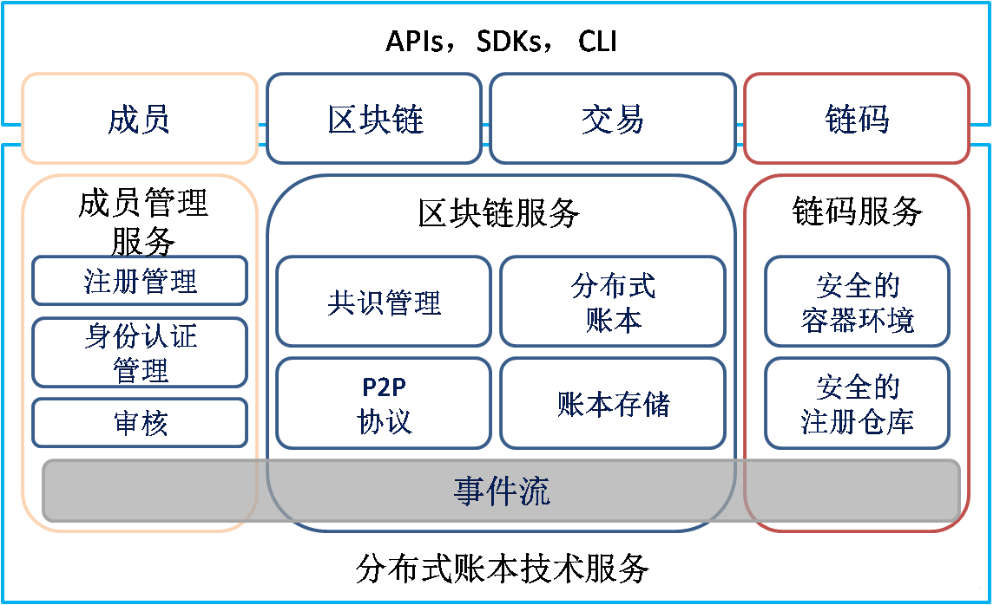
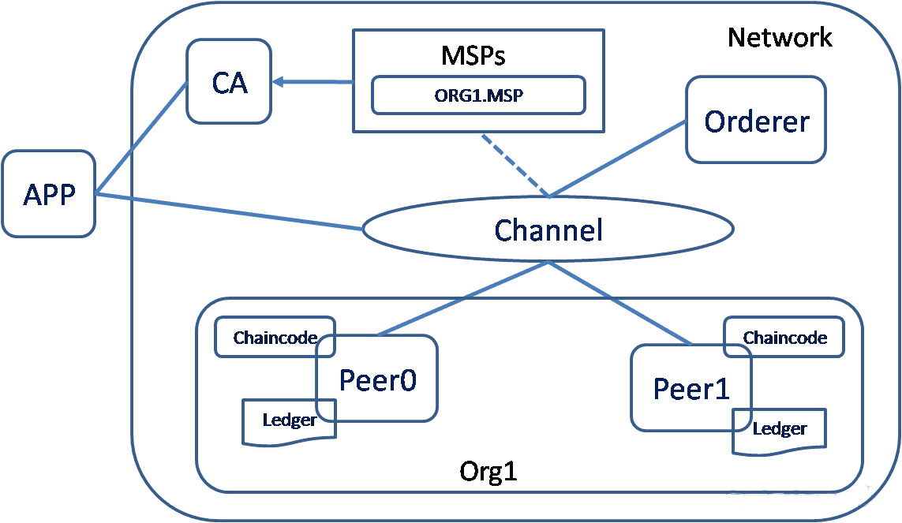

# Course 03

## `Constents`
- [Course 03](#course-03)
	- [`Constents`](#constents)
	- [任务一](#%e4%bb%bb%e5%8a%a1%e4%b8%80)
	- [任务一实现](#%e4%bb%bb%e5%8a%a1%e4%b8%80%e5%ae%9e%e7%8e%b0)
		- [比较抽象的逻辑架构](#%e6%af%94%e8%be%83%e6%8a%bd%e8%b1%a1%e7%9a%84%e9%80%bb%e8%be%91%e6%9e%b6%e6%9e%84)
			- [新特性](#%e6%96%b0%e7%89%b9%e6%80%a7)
			- [Hyperledger Fabric超级账本整体逻辑架构如下图所示：](#hyperledger-fabric%e8%b6%85%e7%ba%a7%e8%b4%a6%e6%9c%ac%e6%95%b4%e4%bd%93%e9%80%bb%e8%be%91%e6%9e%b6%e6%9e%84%e5%a6%82%e4%b8%8b%e5%9b%be%e6%89%80%e7%a4%ba)
			- [Fabric四大核心组件：](#fabric%e5%9b%9b%e5%a4%a7%e6%a0%b8%e5%bf%83%e7%bb%84%e4%bb%b6)
		- [实际中的运行时架构](#%e5%ae%9e%e9%99%85%e4%b8%ad%e7%9a%84%e8%bf%90%e8%a1%8c%e6%97%b6%e6%9e%b6%e6%9e%84)
			- [实际运行时架构如下图所示：](#%e5%ae%9e%e9%99%85%e8%bf%90%e8%a1%8c%e6%97%b6%e6%9e%b6%e6%9e%84%e5%a6%82%e4%b8%8b%e5%9b%be%e6%89%80%e7%a4%ba)
	- [任务二](#%e4%bb%bb%e5%8a%a1%e4%ba%8c)
	- [任务实现二](#%e4%bb%bb%e5%8a%a1%e5%ae%9e%e7%8e%b0%e4%ba%8c)
		- [core.yaml详解](#coreyaml%e8%af%a6%e8%a7%a3)
			- [日志部分：](#%e6%97%a5%e5%bf%97%e9%83%a8%e5%88%86)
			- [peer部分：](#peer%e9%83%a8%e5%88%86)
			- [vm部分：](#vm%e9%83%a8%e5%88%86)
			- [chaincode部分：](#chaincode%e9%83%a8%e5%88%86)
			- [ledger部分：](#ledger%e9%83%a8%e5%88%86)
			- [metrics部分：](#metrics%e9%83%a8%e5%88%86)
		- [orderer.yaml详解](#ordereryaml%e8%af%a6%e8%a7%a3)
			- [General部分：](#general%e9%83%a8%e5%88%86)
			- [FileLedger部分：](#fileledger%e9%83%a8%e5%88%86)
			- [RAMLedger部分：](#ramledger%e9%83%a8%e5%88%86)
			- [Kafka部分：](#kafka%e9%83%a8%e5%88%86)
			- [Debug部分：](#debug%e9%83%a8%e5%88%86)
	

## 任务一

1. 理解Hyperledger Fabric超级账本的逻辑架构。
2. 理解Hyperledger Fabric超级账本的实际运行时架构。

## 任务一实现

### 比较抽象的逻辑架构
#### 新特性
Fabric从1.X开始，在扩展性及安全性上面有了大大的提升，且新增了诸多的新特性：
* 多通道：支持多通道，提高隔离安全性。
* 可拔插的组件：支持共识组件、权限管理组件等可拔插功能。
* 账本数据可被存储为多种格式。
* 分化了Peer节点的多种角色，可以根据具体情况实现灵活部署。

#### Hyperledger Fabric超级账本整体逻辑架构如下图所示：


#### Fabric四大核心组件：
1. **Membership Services**：成员管理保证了Fabric平台访问的安全性。提供了成员的注册、管理及审核功能。
2. **Blockchain Services**：是区块链的核心部分，为区块链的主体功能提供了底层支撑；包括共识管理、分布式账本实现、账本的存储以及网络中各节点之间的通信实现。
	- **BlockChain**：区块之间以Hash连接为结构的交易日志。peer从order service接收交易区块k，并根据背书策略和并发冲突标记区块上的交易是否有效，然后将该区块追加到peer文件系统中的Hash Chain上。
	- **Transaction**：交易有对链码的部署或调用两种操作类型：
		- 部署交易：部署是请求在peer上启动链码容器；创建新的链码并设置一个程序作为参数。当一个部署交易执行成功，表明链码已被安装到区块链上。
		- 调用交易：调用是从账本中请求读写集。是在之前已部署链码的情况下执行一个操作。调用交易将使用链码提供的一个函数。当成功时，链码执行特定的函数对账本数据进行操作（修改状态），并返回操作结果。  
	1. **Chaincode Services**：提供了链码的部署及运行时的所需环境。
   		* Chaincode：是一个可以对账本数据进行操作的可开发的组件程；链码被布署运行在一个安全的容器中；用户可以通过调用链码中的指定函数对账本数据进行修改或读取操作。
	2. **Event**：为各组件之间提供异步通信提供了技术实现。

### 实际中的运行时架构
#### 实际运行时架构如下图所示：



运行时架构图中各项解释如下：  

* **APP**：代表一个客户端（CLI）或SDK，作用是创建交易并获取到足够的背书之后向Orderer排序服务节点提交交易请求（Peer与Orderer节点提供了gRPC远程访问接口，供客户端调用）。
* **CA**：负责对网络中所有的证书进行管理(对Fabric网络中的成员身份进行管理), 提供标准的PKI服务。
* **MSP**（Member Service Provider）：为客户端和Peer提供证书的系统抽象组件。
* **Channel**：将一个大的网络分割成为不同的私有"子网"。
	- 通道的作用：通道提供一种通讯机制，将peers和orderer连接在一起，形成一个具有保密性的通讯链路（虚拟）， 进行数据隔离。

	> 要加入通道的每个节点都必须拥有自己的通过成员服务提供商（MSP）获得的身份标识。
* **Orderer**：对客户端提交的交易请求进行排序，之后生成区块广播给通道内的所有peer节点。
* **Org1**：代表联盟中的某一个组织（一个联盟中可以多个不同的组织组成）。

* **Peer**：表示组织中的节点；Peer节点以区块的形式从Orderer排序服务节点接收有序状态更新，维护状态和账本。在Fabtic网络环境中 Peer 节点可以划分为如下角色：

	- **Endorsing peer**：根据指定的策略调用智能合约，对结果进行背书， 返回提案响应到客户端。
	- **Committing peer**：验证数据并保存至账本中。
	- **Anchor peer**：跨组织通信。
	- **Leading peer**：作为组织内所有节点的的代表连接到Orderer排序服务节点, 将从排序服务节点接收到的批量区块广播给组织内的其它节点。

	> 网络中只有部分节点为背书节点； 网络中所有Peer节点为账本节点。

* **Chaincode**：链式代码，简称链码；运行在容器中，提供相应的API与账本数据进行交互。

* **Ledger**：是由排序服务构建的一个全部有序的交易哈希链块，保存在所有的peer节点中。账本提供了在系统运行过程中发生的可验证历史，它包含所有成功的状态更改（有效交易）和不成功的状态更改（无效交易）。


## 任务二
1. 了解Hyperledger Fabric对Peer节点的核心配置信息
2. 了解Hyperledger Fabric对orderer节点的核心配置信息

## 任务实现二
> 在Hyperledger Fabric中， 有两个示例配置文件，一个为Peer节点的示例配置文件，一个为Orderer节点的示例配置文件，理解这两个配置文件的内容对于我们而言，会更进一步的理解Hyperledger Fabric运行状况。

### core.yaml详解
core.yaml配置文件是Peer节点的示例配置文件，具体路径在 fabric-samples/config 目录下；该core.yaml示例配置文件中共指定了六大部分内容，详见解释如下。

> 在Fabirc源码中的路径为：$GOPATH/src/github.com/hyperledger/fabric/sampleconfig/core.yaml

#### 日志部分：
日志记录级别有六种：
```yaml
CRITICAL | ERROR | WARNING | NOTICE | INFO | DEBUG
```

使用 level 指定默认所有模块为 `info` 级别，然后单独指定 cauthdsl、gossip、grpc、ledger、msp、policies、peer 的 gossip 模块的日志级别，以覆盖默认的日志级别。

format属性指定了日志的输出格式。
```shell
logging:
    level:       info    # 全局的日志级别

    # 单独模块的日志级别，覆盖全局日志级别
    cauthdsl:   warning
    gossip:     warning
    grpc:       error
    ledger:     info
    msp:        warning
    policies:   warning

    peer:
        gossip: warning

    format: '%{color}%{time:2006-01-02 15:04:05.000 MST} [%{module}] %{shortfunc} -> %{level:.4s} %{id:03x}%{color:reset} %{message}'
```

#### peer部分：
peer部分是 Peer 服务的核心配置内容，包括 Peer 的基础服务部分、gossip 部分、event、tls、BCCSP 等相关配置信息
```yaml
peer:
    id: jdoe        # 指定节点ID
    networkId: dev     # 指定网络ID
    listenAddress: 0.0.0.0:7051        #侦听本地网络接口上的地址。默认监听所有网络接口

    #侦听入站链码连接的端点。如果被注释，则选择侦听地址端口7052的对等点地址
    # chaincodeListenAddress: 0.0.0.0:7052    
    # 此peer的链码端点用于连接到peer。如果没有指定，则选择chaincodeListenAddress地址。
    # 如果没有指定chaincodeListenAddress，则从其中选择address 
    # chaincodeAddress: 0.0.0.0:705

    address: 0.0.0.0:7051    # 节点对外的服务地址
    addressAutoDetect: false    # 是否自动探测对外服务地址    
    gomaxprocs: -1    # 进程数限制，－1代表无限制

    # Peer服务与Client的设置
    keepalive:
        # 指定客户机ping的最小间隔，如果客户端频繁发送ping，Peer服务器会自动断开
        minInterval: 60s    

        client:     # 客户端与Peer的通信设置 
            # 指定ping Peer节点的间隔时间，必须大于或等于 minInterval 的值        
            interval: 60s           
            timeout: 20s    # 在断开peer节点连接之前等待的响应时间

        deliveryClient:    # 客户端与Orderer节点的通信设置
            # 指定ping orderer节点的间隔时间，必须大于或等于 minInterval 的值
            interval: 60s             
            timeout: 20s    # 在断开Orderer节点连接之前等待的响应时间

    gossip:   # gossip相关配置    
        bootstrap: 127.0.0.1:7051    # 启动后的初始节点
        useLeaderElection: true     # 是否指定使用选举方式产式Leader
        orgLeader: false    # 是否指定当前节点为Leader
        endpoint:      

        maxBlockCountToStore: 100  # 保存在内存中的最大区块     
        maxPropagationBurstLatency: 10ms    #消息连续推送之间的最大时间(超过则触发，转发给其它节点)
        maxPropagationBurstSize: 10    # 消息的最大存储数量，直到推送被触发 
        propagateIterations: 1    # 将消息推送到远程Peer节点的次数   
        propagatePeerNum: 3  # 选择推送消息到Peer节点的数量     
        pullInterval: 4s    # 拉取消息的时间间隔  
        pullPeerNum: 3      # 从指定数量的Peer节点拉取 
        requestStateInfoInterval: 4s # 确定从Peer节点提取状态信息消息的频率(单位:秒)             
        publishStateInfoInterval: 4s # 确定将状态信息消息推送到Peer节点的频率     
        stateInfoRetentionInterval:  # 状态信息的最长保存时间     
        publishCertPeriod: 10s      #  启动后包括证书的等待时间
        skipBlockVerification: false     # 是否应该跳过区块消息的验证   
        dialTimeout: 3s     # 拨号的超时时间     
        connTimeout: 2s     # 连接超时时间    
        recvBuffSize: 20    # 接收到消息的缓存区大小    
        sendBuffSize: 200    # 发送消息的缓冲区大小
        digestWaitTime: 1s  # 处理摘要数据的等待时间     
        requestWaitTime: 1500ms      # 处理nonce之前等待的时间   
        responseWaitTime: 2s   # 终止拉取数据处理的等待时间    
        aliveTimeInterval: 5s      # 心跳检查间隔时间  
        aliveExpirationTimeout: 25s    # 心跳消息的超时时间    
        reconnectInterval: 25s       # 重新连接的间隔时间 
        externalEndpoint:    # 组织外的端点

        election:   # 选举Leader配置     
            startupGracePeriod: 15s       # 最长等待时间 
            membershipSampleInterval: 1s  # 检查稳定性的间隔时间     
            leaderAliveThreshold: 10s     # 进行选举的间隔时间
            leaderElectionDuration: 5s    # 声明自己为Leader的等待时间

        pvtData:    # 私有数据配置
            # 尝试从peer节点中提取给定块对应的私有数据的最大持续时间
            pullRetryThreshold: 60s    
            # 当前分类帐在提交时的高度之间的最大差异
            transientstoreMaxBlockRetention: 1000            
            pushAckTimeout: 3s   # 等待每个对等方确认的最大时间         
            # 用作缓冲器；防止peer试图获取私有数据来自即将在接下来的N个块中被清除的对等节点
            btlPullMargin: 10    

    events:    
        address: 0.0.0.0:7053    # 指定事件服务的地址
        buffersize: 100    # 可以在不阻塞发送的情况下缓冲的事件总数
        # 将事件添加到一个完整的缓冲区时要阻塞多长时间
        # 如果小于0，直接丢弃
        # 如果等于0，事件被添加至缓冲区并发出
        # 如果大于0，超时还未发出则丢弃
        timeout: 10ms    
        # 在注册事件中指定的时间和客户端时间之间的差异
        timewindow: 15m    

        keepalive: # peer服务器与客户端的实时设置           
            minInterval: 60s    # 允许客户端向peer服务器发送ping的最小间隔时间

        sendTimeout: 60s    # GRPC向客户端发送事件的超时时间

    tls:    # TLS设置 
        enabled:  false   # 是否开启服务器端TLS    
        # 是否需要客户端证书（没有配置使用证书的客户端不能连接到对等点）
        clientAuthRequired: false    

        cert:    # TLS服务器的X.509证书
            file: tls/server.crt

        key:    # TLS服务器(需启用clientAuthEnabled的客户端)的签名私钥
            file: tls/server.key

        rootcert:    # 可信任的根CA证书
            file: tls/ca.crt

        clientRootCAs:    # 用于验证客户端证书的根证书
            files:
              - tls/ca.crt

        clientKey:    # 建立客户端连接时用于TLS的私钥。如果没有设置将使用peer.tls.key
            file:

        clientCert:    # 建立客户端连接时用于TLS的证书。如果没有设置将使用peer.tls.cert
            file:

    authentication:    # 与身份验证相关的配置
        timewindow: 15m    # 当前服务器时间与客户端请求消息中指定的客户端时间差异

    fileSystemPath: /var/hyperledger/production    # 文件存储路径

    BCCSP:    # 区块链加密实现
        Default: SW        # 设置SW为默认加密程序  
        SW:      # SW加密配置（如果默认为SW）       
            Hash: SHA2        # 默认的哈希算法和安全级别
            Security: 256    # 

            FileKeyStore:    # 密钥存储位置
                # 如果为空，默认为'mspConfigPath/keystore'
                KeyStore:

        PKCS11:  # PKCS11加密配置（如果默认为PKCS11）
            Library:    # PKCS11模块库位置           
            Label:    # 令牌Label

            Pin:
            Hash:
            Security:
            FileKeyStore:
                KeyStore:

    # MSP配置路径，peer根据此路径找到MSP本地配置
    mspConfigPath: msp
    localMspId: SampleOrg    #本地MSP的标识符

    client:    # CLI客户端配置选项
        connTimeout: 3s    # 连接超时

    deliveryclient:    # 订购服务相关的配置        
        reconnectTotalTimeThreshold: 3600s    # 尝试重新连接的总时间
        connTimeout: 3s    # 订购服务节点连接超时
        reConnectBackoffThreshold: 3600s    # 最大延迟时间

    localMspType: bccsp    # 本地MSP类型（默认情况下，是bccsp类型）

    # 仅在非生产环境中与Go分析工具一起使用。在生产中，它应该被禁用
    profile:
        enabled:     false
        listenAddress: 0.0.0.0:6060

    # 用于管理操作，如控制日志模块的严重程度等。只有对等管理员才能使用该服务
    adminService:

    # 定义处理程序可以过滤和自定义处理程序在对等点内传递的对象
    handlers:
        authFilters:
          -
            name: DefaultAuth
          -
            name: ExpirationCheck   
        decorators:
          -
            name: DefaultDecorator
        endorsers:
          escc:
            name: DefaultEndorsement
            library:
        validators:
          vscc:
            name: DefaultValidation
            library:

    # 并行执行事务验证的goroutines的数量（注意重写此值可能会对性能产生负面影响）
    validatorPoolSize:

    # 客户端使用发现服务查询关于对等点的信息
    # 例如——哪些同行加入了某个频道，最新消息是什么通道配置
    # 最重要的是——给定一个链码和通道，什么可能的对等点集满足背书政策
    discovery:
        enabled: true        
        authCacheEnabled: true        
        authCacheMaxSize: 1000       
        authCachePurgeRetentionRatio: 0.75       
        orgMembersAllowedAccess: false
```
#### vm部分：
对链码运行环境的配置，目前主要支持 `Docker` 容器
```yaml
vm:
    endpoint: unix:///var/run/docker.sock    # vm管理系统的端点

    docker:    # 设置docker
        tls:
            enabled: false
            ca:
                file: docker/ca.crt
            cert:
                file: docker/tls.crt
            key:
                file: docker/tls.key

        attachStdout: false    # 启用/禁用链码容器中的标准out/err

        # 创建docker容器的参数
        # 使用用于集群的ipam和dns-server可以有效地创建容器设置容器的网络模式
        # 支持标准值是：“host”(默认)、“bridge”、“ipvlan”、“none”
        # Dns -供容器使用的Dns服务器列表
        #注:'Privileged'、'Binds'、'Links'和'PortBindings'属性不支持Docker主机配置，设置后将不使用
        hostConfig:
            NetworkMode: host
            Dns:
               # - 192.168.0.1
            LogConfig:
                Type: json-file
                Config:
                    max-size: "50m"
                    max-file: "5"
			Memory: 2147483648
```
#### chaincode部分：
与链码相关的配置
```yaml
chaincode:
    id:    
        path:
        name:
    # 通用构建器环境，适用于大多数链代码类型
    builder: $(DOCKER_NS)/fabric-ccenv:latest

    # 在用户链码实例化过程中启用/禁用基本docker镜像的拉取
    pull: false

    golang:    # golang的baseos
        runtime: $(BASE_DOCKER_NS)/fabric-baseos:$(ARCH)-$(BASE_VERSION)
        dynamicLink: false    # 是否动态链接golang链码

    car:
        #　平台可能需要更多的扩展工具(JVM等)。目前，只能使用baseos
        runtime: $(BASE_DOCKER_NS)/fabric-baseos:$(ARCH)-$(BASE_VERSION)

    java:
        # 用于Java链代码运行时，基于java:openjdk-8和加法编译器的镜像
        Dockerfile:  |
            from $(DOCKER_NS)/fabric-javaenv:$(ARCH)-1.1.0

    node:  
        # js引擎在运行时，指定的baseimage（不是baseos）
        runtime: $(BASE_DOCKER_NS)/fabric-baseimage:$(ARCH)-$(BASE_VERSION)

    startuptimeout: 300s    # 启动超时时间
    executetimeout: 30s        # 调用和Init调用的超时持续时间
    mode: net    # 指定模式（dev、net两种）
    keepalive: 0    # Peer和链码之间的心跳超时，值小于或等于0会关闭

    system:    # 系统链码白名单
        cscc: enable
        lscc: enable
        escc: enable
        vscc: enable
        qscc: enable

    systemPlugins:    # 系统链码插件:

    logging:   # 链码容器的日志部分  
      level:  info
      shim:   warning
	  format: '%{color}%{time:2006-01-02 15:04:05.000 MST} [%{module}] %{shortfunc} -> %{level:.4s} %{id:03x}%{color:reset} %{message}'
```

#### ledger部分：
分类帐的配置信息。
```yaml
ledger:
  blockchain:

  state: 
    stateDatabase: goleveldb    # 指定默认的状态数据库
    couchDBConfig:    # 配置couchDB信息
       couchDBAddress: 127.0.0.1:5984    # 监听地址
       username:
       password:
       maxRetries: 3    # 重新尝试CouchDB错误的次数
       maxRetriesOnStartup: 10      #　对等启动期间对CouchDB错误的重试次数 
       requestTimeout: 35s      #　对等启动期间对CouchDB错误的重试次数 
       queryLimit: 10000     #　限制每个查询返回的记录数量  
       maxBatchUpdateSize: 1000      #　限制每个CouchDB批量更新的记录数量

       #　值为１时将在每次提交块后对进行索引
       # 增加值可以提高peer和CouchDB的写效率，但是可能会降低查询响应时间
       warmIndexesAfterNBlocks: 1    

  history:    
	enableHistoryDatabase: true        # 是否开启历史数据库
```

#### metrics部分：
```yaml
metrics:
    enabled: false    # 启用或禁用metrics服务器
    # 当启用metrics服务器时
    # 必须使用特定的metrics报告程序类型当前支持的类型:“statsd”、“prom”
    reporter: statsd
    interval: 1s    # 确定报告度量的频率

    statsdReporter:
          address: 0.0.0.0:8125    # 要连接的statsd服务器地址
          flushInterval: 2s    # 确定向statsd服务器推送指标的频率
          # 每个push metrics请求的最大字节数 #内部网推荐1432，互联网推荐512
          flushBytes: 1432    

    promReporter:
		  listenAddress: 0.0.0.0:8080    # http服务器监听地址
```

### orderer.yaml详解

`orderer.yaml` 配置文件是 Orderer 节点的示例配置文件，具体路径在 `fabric-samples/config` 目录下；该 orderer.yaml 示例配置文件中共指定了五大部分内容，详细解释见如下内容。

> 在 Fabirc 源码中的路径为：`$GOPATH/src/github.com/hyperledger/fabric/sampleconfig/orderer.yaml`

该 `orderer.yaml` 示例配置文件中共指定了五大部分内容：

#### General部分：
```yaml
General:
    LedgerType: file    # 指定账本类型（可选file、RAM、json三种）
    ListenAddress: 127.0.0.1    # 监听地址
    ListenPort: 7050    # 监听端口号

    TLS:    # GRPC服务器的TLS设置
        Enabled: false    # 默认不启用
        PrivateKey: tls/server.key    # 签名的私钥文件
        Certificate: tls/server.crt    # 证书文件
        RootCAs:    # 可信任的根CA证书
          - tls/ca.crt
        ClientAuthRequired: false
        ClientRootCAs:

    Keepalive:    # GRPC服务器的激活设置
        ServerMinInterval: 60s    # 客户机ping之间的最小允许时间
        ServerInterval: 7200s    # 连接到客户机的ping之间的时间
        ServerTimeout: 20s    # 服务器等待响应的超时时间

    LogLevel: info

    LogFormat: '%{color}%{time:2006-01-02 15:04:05.000 MST} [%{module}] %{shortfunc} -> %{level:.4s} %{id:03x}%{color:reset} %{message}'

    GenesisMethod: provisional    # 生成初始区块的提供方式（可选provisional、file两种）
    GenesisProfile: SampleInsecureSolo    # 用于动态生成初始区块的概要
    GenesisFile: genesisblock    # 生成初始区块的配置文件 

    LocalMSPDir: msp    # 本地MSP目录 
    LocalMSPID: SampleOrg    # MSP ID

    Profile:    # 是否为Go“profiling”配置启用HTTP服务
        Enabled: false
        Address: 0.0.0.0:6060

    BCCSP:    # 区块链加密实现
        Default: SW    # 默认使用SW
        SW:
            Hash: SHA2
            Security: 256
            FileKeyStore:
                KeyStore:

    Authentication:    # 与身份验证相关的配置
		TimeWindow: 15m    # # 当前服务器时间与客户端请求消息中指定的客户端时间差异
```
#### FileLedger部分：

文件账本配置信息
```yaml
FileLedger:
    Location: /var/hyperledger/production/orderer    # 区块存储路径
	Prefix: hyperledger-fabric-ordererledger    # 在临时空间中生成分类目录时使用的前缀
```
#### RAMLedger部分：
内存账本配置信息
```yaml
RAMLedger:
	HistorySize: 1000    # 如果设置为保存在内存中，分类帐最大保留的块的数量
```

#### Kafka部分：

Kafka 集群的配置信息
```yaml
Kafka:
    Retry:    # 无法建立到Kafka集群的连接时的重试请求    
        ShortInterval: 5s    # 重试时间间隔
        ShortTotal: 10m        # 重试的总时间
        LongInterval: 5m    # 重试失败后再次发送重试的时间间隔
        LongTotal: 12h        # 重试的最长总时间
        NetworkTimeouts:    # 网络超时设置
            DialTimeout: 10s
            ReadTimeout: 10s
            WriteTimeout: 10s
        Metadata:    # 请求领导人选举时影响元数据的设置
            RetryBackoff: 250ms    # 指定重试的最大时间
            RetryMax: 3    # 重试的最大次数
        Producer:    # 向Kafka集群发送消息失败的设置
            RetryBackoff: 100ms    # 指定重试的最大时间
            RetryMax: 3    # 重试的最大次数
        Consumer:    # 向Kafka集群读取消息失败的设置
            RetryBackoff: 2s    # 指定重试的最大时间

    Verbose: false    # 是否为与Kafka集群的交互启用日志记录

    TLS:    # Orderer连接到Kafka集群的TLS设置
      Enabled: false    # 连接到Kafka集群时是否使用TLS
      PrivateKey:      
      Certificate:       
      RootCAs:

	Version:    # Kafka版本(未指定默认值为0.10.2.0)
```

#### Debug部分：
调试配置信息
```yaml
Debug:
    BroadcastTraceDir:    # 对广播服务的每个请求写入此目录中的文件
	DeliverTraceDir:    # 对交付服务的每个请求写入此目录中的文件
```
