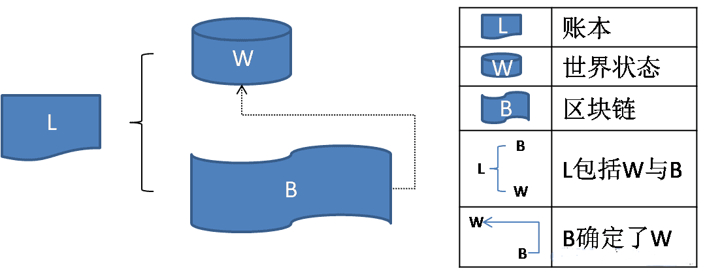
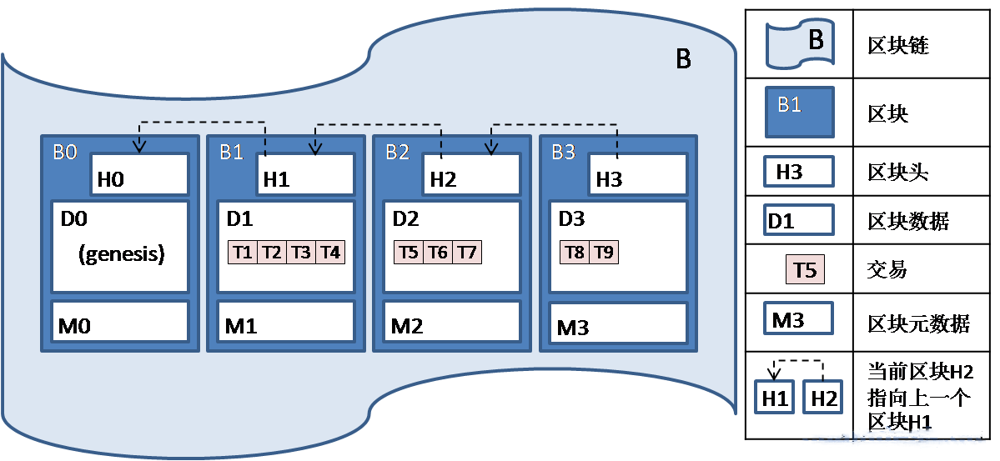
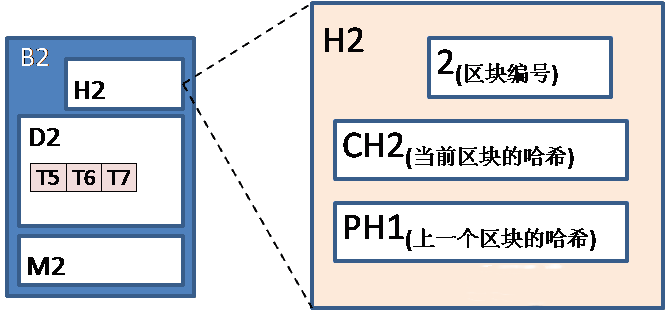
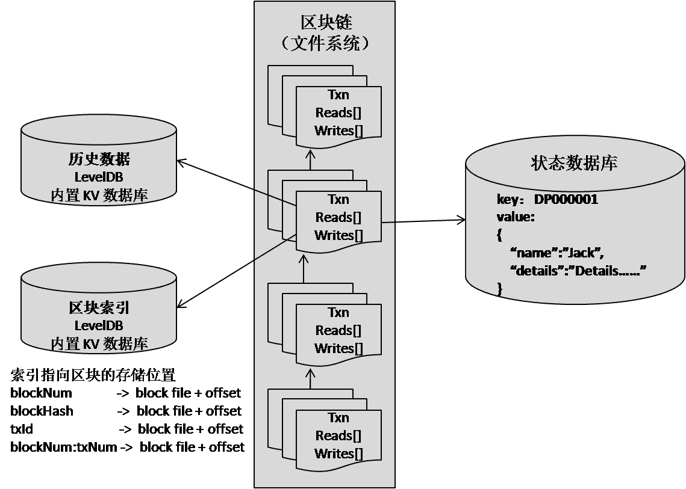

# Course 10 Fabric 分布式账本数据存储

## `Contents`
- [Course 10 Fabric 分布式账本数据存储](#course-10-fabric-%e5%88%86%e5%b8%83%e5%bc%8f%e8%b4%a6%e6%9c%ac%e6%95%b0%e6%8d%ae%e5%ad%98%e5%82%a8)
  - [`Contents`](#contents)


区块链账本数据
分类账本中保存着所有交易变化的记录，具有有序和防篡改的特点。每一次交易链码需要将数据变化记录在分布式账本中，需要记录的数据称为状态, 以键值对（ K-V ）的形式进行存储。

Hyperledger Fabric 账本由两个不同但相关部分组成：

世界状态（World State）
区块链（Blockchain）


世界状态：保存世界状态的实际上是一个NoSQL数据库，以方便对状态的存储及检索；以键值对的方式保存一组分类帐状态的最新值。可以使应用程序无须遍历整个事务日志而快速获取当前账本的最新值。其 value 可以是一个简单的值，也可以由一组键值对组成的复杂数据组成。如下图所示：


从上图中可以看到，对于每一个世界状态都具有一个版本号，起始版本号的值为0。每次对状态进行更改时，状态的版本号都会递增。对状态进行更新时也会检查，确保它与创建事务时的版本匹配。

区块链：是一个记录交易日志的文件系统，它是由哈希值链接的 N 个区块构造而成；每个区块包含一系列的多个有序的交易。区块头中包含了本区块所记录交易的哈希值，以及前一个区块头的哈希值。通过这种方式，分类账本中的所有交易都被有序的并以加密的形式链接一起。换言之，在分布式网络中，如果不破坏哈希链的话，根本无法篡改账本数据。


在上图中，我们可以看到区块 B2 具有 区块数据 D2，其包含其所有事务：T5，T6，T7。最重要的是，区块 B2 的区块头（H2）中其包含 D2 中所有事务的加密散列以及来自前一区块（B1）的等效散列。通过这种链接方式，使得区块之间彼此有着不可分割的联系。

下面我们详细分析区块及交易所包含的详细结构。

区块：每一个区块都由三部分组成



如上图所示，区块 B2 的区块头（H2）由区块编号号（2），当前块数据（D2）的哈希（CH2）和来自上一个区块（块号1）的哈希（PH1）的副本组成。

区块头（Block Header）：区块头包含三个字段，在创建区块时写入。

区块编号（Block number）：从0开始的整数，对于追加到区块链的每个新的区块都会在前一个值的基础之上递增1。
当前区块哈希值（Current Block Hash）：当前块中包含的所有事务的哈希值。
上一个区块哈希（Previous Block Hash）：区块链中上一个区块的哈希副本。
区块数据（Block Data）

在创建块时写入，包含按顺序排列的一系列交易。

区块元数据（Block Metadata）

此部分包含写入区块的时间，以及相应的证书，公钥和签名。随后，Block Committer 还为每个交易添加了一个有效/无效的指示符（也称之为位掩码）。

现在我们了解了区块中的结构，那么，区块数据中的交易结构又是什么样的，下面我们进一步来了解交易/事务的详细结构。

交易：区块中的区块数据（Block Data）包含了一系列的交易的详细结构，该交易记录了世界状态的变化。


如上图所示：区块 B1 的区块数据（D1）中的事务（T4）包括事务头（H4），事务签名（S4），事务提案（P4），事务响应（R4）和背书列表（E4）。

事务头（Header）

获取有关事务的一些基本元数据如：链码相关的名称及其版本。

事务签名（Signature）

该部分包含使用客户端应用程序私钥而创建的加密签名。用于检查事务内容是否被篡改。

事务提案（Proposal）

包含要调用的链码的函数名称、调用函数所需的输入参数，链码根据提交的事务提案对分类帐进行更新。

事务响应（Response）

调用链码模拟执行后获取到世界状态的前后值，作为读写集（RW-set）返回给客户端。

背书列表（Endorsements）

交易中只包含一个交易响应，但有多个来自所需组织的背书签名，以满足所需的背书策略。

9.1.2 数据存储
区块链是以文件的形式进行存储的，各区块文件默认以 blockfile_ 为文件前缀，后面以六位数字命名，起始数字默认为 000000，如有新文件则每次递增1。区块链文件默认存储目录： /var/hyperledger/production/ledgersData/chains 中，该目录中包括两个子目录： 保存区块链文件的chains 目录（以通道文件目录区分各 Ledger，各个 Peer 节点对于它所属的每个通道，都会保存一份该通道的账本副本）与使用 levelDB 实现保存索引信息的 index 目录。目录结构如下：

```shell
root@a37b2b8a2858:/var/hyperledger/production/ledgersData/chains# ll
chains
  |----mychannel
  |----|----blockfile_000000
index
  |----000001.log
  |----CURRENT
  |----LOCK
  |----LOG
  |----MANIFEST-000000
```


Orderer 节点本身保存一份账本，但不包括状态数据库及历史索引数据，这些都是由 Peer 节点进行维护：

状态数据库（State Database）：存储了交易日志中所有 key 的最新值（World State），默认数据库使用 LevelDB。链码调用基于当前的状态数据执行交易。
历史数据库（History Database）：以 LevelDB 数据库作为数据存储载体，存储区块中有效交易相关的 key，而不存储 value（数据库不允许 value 为空，所以实际上 value 都为 []byte{}）。



> idStore：存储 Peer 加入的所有的 ledgerId（或称之为 chainid/channelId）。且保证账本编号在全局中的唯一性。默认存储目录为： /var/hyperledger/production/ledgersData/ledgerProvider


读写集

模拟交易和读写集

在模拟执行交易后，背书节点（Endorser）会生成读写集（Read-Write Set），读集（Read Set）中包含了交易在模拟执行期间读取的唯一 key 与对应已提交的值及其提交 version 的列表，写集（Write Set）中包含一个唯一键列表以及交易写入的新值。如果交易执行的是删除操作，则在写集（Write Set）中为该 key 设置一个删除标记。如果在一个交易中对同一个 key 多次进行更改，则仅保留最后更改的值（即最新值）。另外，如果交易读取指定 key 的值，只会返回已提交的状态值，而不能读取到同一交易中修改但未提交的值。

如上所述，key 的 version 只被包含在读集（Read Set）中；写集（Write Set）只包含 key 列表及其最新值。

version 为指定 key 生成一个非重复标识符，可以有各种方案来实现，如使用单调递增的数字来表示。在当前实现中，使用的是基于区块链高度的方式来表示，就是用交易的 height 作为该交易所修改的 key 的 version，交易的 height 由一个 Version 结构体表示（见下面Version struct），其中 TxNum 表示这个 tx 在区块中的编号。该方案相较于递增序号有很多优点，主要是可以很好地利用到诸如 statedb、模拟交易和交易验证这些模块中。


```Go

type RangeQueryInfo struct {
    StartKey     string 
    EndKey       string 
    ItrExhausted bool   
    ReadsInfo isRangeQueryInfo_ReadsInfo 
}

......

type KVRead struct {
    Key     string   
    Version *Version 
}

type KVWrite struct {
    Key      string 
    IsDelete bool  
    Value    []byte 
}

type Version struct {
    BlockNum uint64 
    TxNum    uint64 
}
```

下面是一个通过模拟假设事务准备的示例读写集的示例。为了方便，我们使用递增数字序号来表示版本号：

```xml
<TxReadWriteSet>
  <NsReadWriteSet name="chaincode1">
    <read-set>
      <read key="K1", version="1" />
      <read key="K2", version="1" />
    </read-set>
    <write-set>
      <write key="K1", value="V1" />
      <write key="K3", value="V2" />
      <write key="K4", isDelete="true" />
    </write-set>
  </NsReadWriteSet>
<TxReadWriteSet>
```


另外，如果事务在模拟期间执行的是范围查询，则范围查询及其结果将添加到读写集中，使用query-info 来表示。

交易验证和更新世界状态

commiter 节点使用读写集的读集部分来进行交易的有效性的检查，写集部分更新受影响的 key 的版本号和值。

在验证阶段，使用读集中的每个 key 的版本号与状态数据库中的世界状态（world state）进行比较，如果匹配，则认为此交易有效。如果读写集还包含一个或多个查询信息（query-info），则执行额外的验证。该验证确保在此批量查询的结果范围内没有 key 被新增、删除或更改。换句话说，如果在进行验证期间重新执行任何的范围查询(事务在模拟过程中执行)，应该产生与交易在模拟执行时得到的结果相同。此验证确保交易在提交时如果出现幻读则会被认为无效。注意，幻读保护只实现了Chaincode调用的 GetStateByRange 方法，其他批量查询方法（如：GetQueryResult）则会有幻读风险，因此应该只在不需要提交给排序的只读事务中使用，除非应用程序能够保证模拟阶段和验证阶段结果集的稳定性。

如果交易通过了有效性检查，则 commiter 节点使用写集来更新世界状态。在更新阶段，对于写集中存在的每个 key，世界状态中对应的的 value 与版本号都会被更新。

模拟和验证示例

为了帮助理解读写集，我们来看一个模拟示例。假设在 worldState 中由元组(k,ver,val)表示，其中 key 为 k，var是 k 的新最 version， val是 k 的 value。

有五个交易，分别是 T1、T2、T3、T4、T5，这五个交易的模拟过程是针对相同的 worldSate 快照，下面的代码片段显示了每个交易执行读写的顺序。

```
World state: (k1,1,v1), (k2,1,v2), (k3,1,v3), (k4,1,v4), (k5,1,v5)
T1 -> Write(k1, v1'), Write(k2, v2')
T2 -> Read(k1), Write(k3, v3')
T3 -> Write(k2, v2'')
T4 -> Write(k2, v2'''), read(k2)
T5 -> Write(k6, v6'), read(k5)
```

现在假设交易的顺序为 T1~T5：

T1 验证成功，因为它没有 read 操作。之后在 worldState 中的 k1 和 k2 会被更新成(k1,2,v1'), (k2,2,v2')
T2 验证失败，因为它读取的 k1 在之前的交易 T1 中被修改了
T3 验证成功，因为它没有 read 操作。之后在 worldState 中的 k2 会被更新成 (k2,3,v2'')
T4 验证失败，因为它读取的 k2 在之前的交易 T1 中被修改了
T5 验证成功，因为它读取的 k5 没有在之前的任何交易中修改


